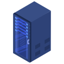

# The Mainframe

Kubernetes services for my home

## Requirements

* Helm
* Kubectl
* RaspberryPi
* Two Way Mirror
* Kubernetes Cluster
* Domain Name (optional)
* DNS Server (optional)

### Services

The following services will be installed on the server:

#### HomeAssistant

HomeAssistant allows you to have a SmartHome platform for all your gadgets.

#### Kubernetes Dashboard

Allows you to track all the Kubernetes resources.

#### Smart Mirror

Makes your mirror smart showing notifications, the news, weather...

